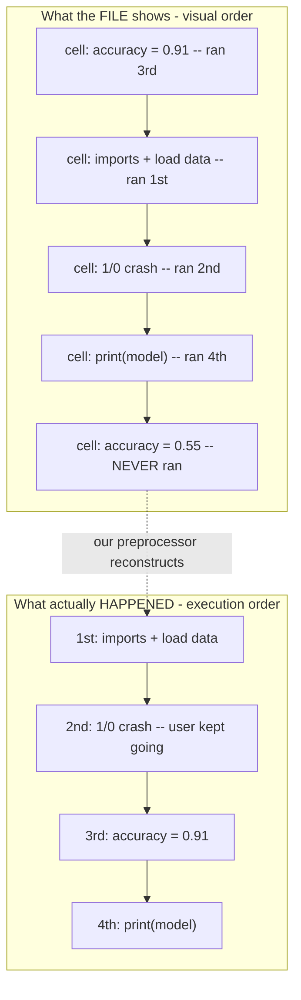
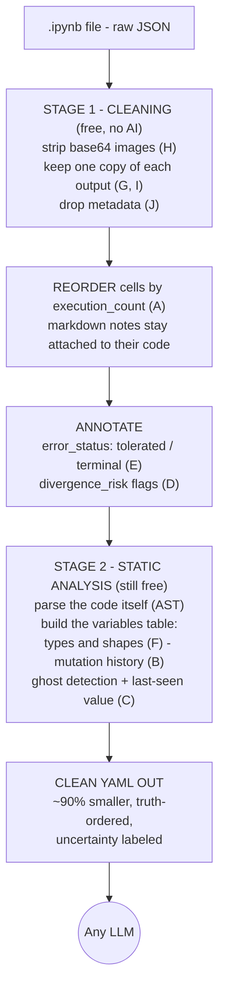
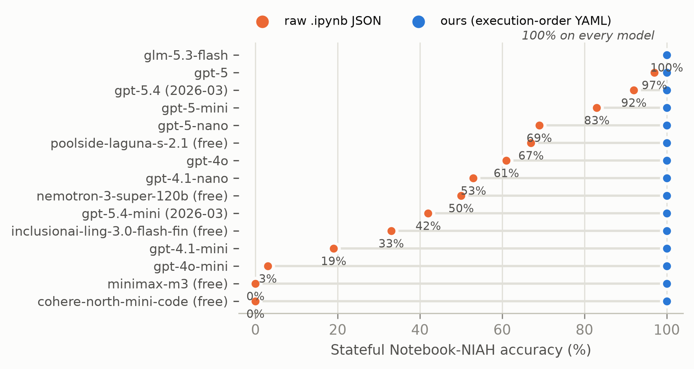
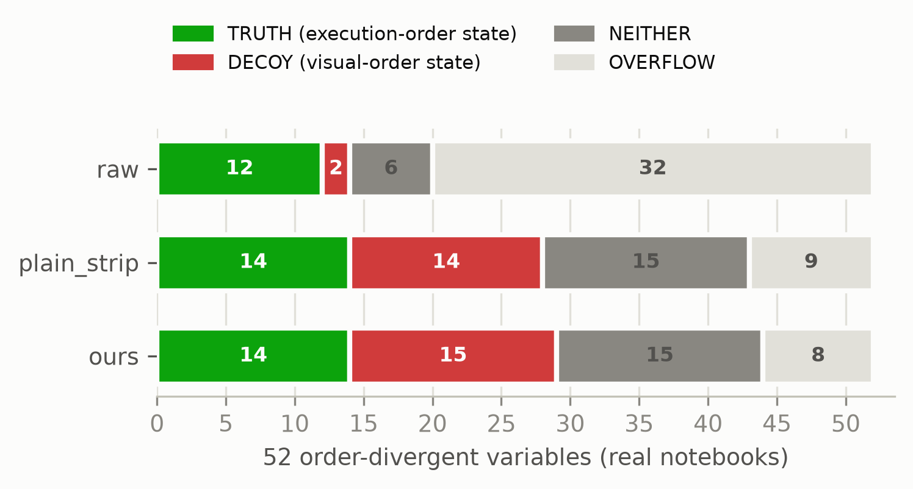
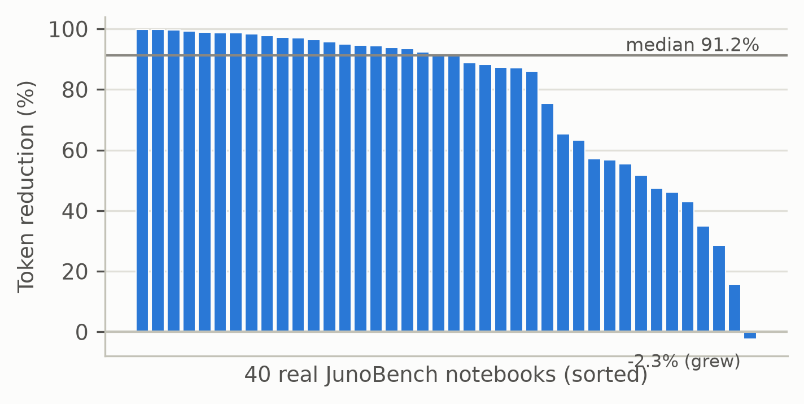

# The Plain-Language Guide to This Project

*Everything in this repo, explained simply: what problem we solve, every term you'll meet, how the tool works, and why it beats the alternatives — with real examples from our own code.*

---

## 1. The project in one paragraph

When you ask an AI (like ChatGPT) to help with a Jupyter notebook, you have to send it the notebook file. That file — `.ipynb` — is a **terrible** thing to send: it's bloated with junk the AI can't use (costing you money), and worse, it **lies about what actually happened** when the notebook ran. We built a small, free program — the **preprocessor** — that cleans the file and, crucially, **rearranges it to tell the truth**. Result: the AI answers questions about the notebook correctly where it used to fail, and the file shrinks by ~90% so every question costs a tenth as much.

---

## 2. Glossary — every term, in order of appearance

| Term | Plain meaning |
|---|---|
| **`.ipynb` file** | A Jupyter notebook saved to disk. Under the hood it's a JSON text file containing every cell's code, outputs, and bookkeeping data. |
| **Cell** | One box of code (or text) in a notebook. You run cells one at a time, in any order you like. |
| **`execution_count`** | The little number `[7]` next to a cell. It records *when* the cell was run: 1 = ran first, 2 = ran second… This is the only record of the true order. |
| **Visual order vs execution order** | Visual order = the order cells *appear* in the file, top to bottom. Execution order = the order they were actually *run*. These often disagree, because people jump around while working. |
| **Token** | The unit AI models read and charge by (~¾ of a word). A 100,000-token notebook costs real money *every single question you ask about it*. |
| **Context window** | The maximum number of tokens a model can read at once (e.g. 128,000 for gpt-4o). A file bigger than this literally cannot be sent. |
| **Serialization** | Just a fancy word for "how you turn the notebook into text before giving it to the AI." Raw JSON is one serialization; ours is another. |
| **Base64** | A way of storing images as a huge block of gibberish text (`iVBORw0KGgo...`). A single chart can be thousands of tokens of pure noise the AI cannot see as an image. |
| **MIME bundle** | The notebook stores each output in *multiple formats at once* (plain text + HTML + sometimes LaTeX) — mostly duplicates, each costing tokens. |
| **YAML** | A cleaner text format than JSON — fewer brackets and quotes, so ~30% fewer tokens for the same content. |
| **Ghost variable** | A variable that *exists* in the running notebook but whose defining cell was **deleted**. The code still uses it, but no cell in the file creates it. The AI sees "undefined variable" and wrongly thinks the code is broken. |
| **Phantom variable** (our term) | The mirror image: a variable whose defining cell is **visible in the file**, but that cell actually *failed* or never ran — so the variable never really existed. A naive reader confidently believes in a value that was never there. |
| **In-place mutation** | Changing data without an assignment, e.g. `df.dropna(inplace=True)` silently deletes rows of `df`. There's no `df = ...` line, so it's easy to miss that `df` changed. |
| **Tolerated error** | A cell that crashed, but the user *kept going anyway* (cells with higher execution counts exist after it). The notebook isn't broken there — the user worked around it. |
| **Divergence risk** | Code whose output would change if re-run: random numbers, today's date, reading a file that may have changed. The saved output may already be stale. |
| **NIAH ("Needle in a Haystack")** | A standard way to test AI reading: hide one fact (the *needle*) inside a huge pile of filler (the *haystack*) and check if the model finds it. |
| **Decoy** | In our tests: a *wrong* value planted where a lazy reader would look, with the *right* value only findable by reading correctly. If the model answers with the decoy, we know exactly *how* it failed. |
| **Baseline / control** | The alternatives we compare against, and stripped-down versions of our own tool that isolate *which part* does the work. |
| **Ablation** | Turning off one feature at a time to see what it contributes. "Reordering only, no variable table" is an ablation. |
| **Overflow** | A prompt too big for the context window. In our tests this is recorded separately — a model is never called "wrong" for an answer it physically couldn't give. |

---

## 3. The problem: two flaws that fight each other

A `.ipynb` file has **two** independent problems, and — as we'll see at the end — you can't fix one without making the other worse. Here's the first, as a short story.

### Problem 1 — the file lies about what happened (*state*)

You're debugging a notebook. You run the import cell, then a modeling cell. It crashes. You scroll **up**, add a fix cell above, run it, then re-run the bottom. It works. You save and send the file to an AI: *"why did my accuracy change?"*

The AI reads the file **top to bottom** — but that's not the order anything happened. It's reading a *shuffled transcript* and doesn't know it.



Ask that AI *"what is `accuracy`?"* — reading top to bottom, the **last** assignment it sees is `0.55`. But that cell **never ran**. The true answer is `0.91`. This isn't rare: we measured **59.8% of real crashed notebooks are saved out of order**, and **92% carry at least one hazard** like this.

### Problem 2 — the file wastes your money (*cost*)

That same file is stuffed with base64 images, duplicate HTML tables, and metadata. Every one of those tokens costs money **on every question you ask about the notebook**. One real notebook in our test set is **7.5 million tokens** raw — physically impossible to send to any model — and shrinks to **10,548 tokens** after preprocessing. Same information, for the AI's purposes.

### Why you can't just fix one — the Coupling Problem

The two problems pull in opposite directions:

- Fix the **cost** problem the obvious way — delete outputs — and you also delete the evidence of what happened (**state**).
- Fix the **state** problem the obvious way — add more context — and you spend more **tokens**.

Every existing tool picks one side and loses the other. We break the trap by **reorganizing** the file (putting cells in true execution order and labeling what's uncertain) instead of only adding or deleting — so we cut cost *and* restore state at the same time.

---

## 4. The ten root causes (why `.ipynb` confuses AIs)

**State problems** — the file misleads:

| Code | Name | One-liner |
|:---:|---|---|
| A | Non-linear execution | File order ≠ run order (the story above) |
| B | In-place mutation | Data changes with no visible assignment |
| C | Ghost variables | Variable's creating cell was deleted; it still "exists" |
| D | Re-execution divergence | Saved output may not match what re-running gives |
| E | Silenced errors | A crash the user deliberately worked around looks like a broken notebook |
| F | Type erasure | Outputs are stored as plain text; "this is a 1000×5 table" is lost |

**Cost problems** — the file wastes tokens:

| Code | Name | One-liner |
|:---:|---|---|
| G | Redundant MIME | Same output stored 2–3 times in different formats |
| H | Base64 noise | Images stored as thousands of tokens of gibberish |
| I | Accumulated outputs | Re-running a cell 10 times can leave 10 stale outputs |
| J | JSON overhead | Brackets, quotes, and repeated key names, paid on every cell |

---

## 5. The key idea: three tiers of honesty

Here's the insight that shapes the whole design. For causes **B, C, D**, the truth **is not in the file at all** — no program can recover what was never saved. So instead of pretending, each cause gets one of three honest treatments:

1. **RESOLVE** (A, G–J): the truth *is* recoverable → recover it. Sort by `execution_count`, strip the junk, convert to YAML.
2. **DETECT & FLAG** (B–F): the truth is *not* recoverable → **tell the AI exactly where its knowledge is unreliable.** A flagged unknown prevents confident wrong answers; a silent unknown invites them.
3. **RUNTIME VERIFY** (optional): if you're allowed to actually *re-run* the notebook, a sandbox can recover the real values and check the flags.

---

## 6. Architecture: what the preprocessor actually does



Two facts worth knowing:
- **Zero AI cost.** The whole pipeline is deterministic Python (`src/preprocessor.py`, `src/state_extractor.py`). It never calls a model, so cleaning a notebook is free and gives the same answer every time.
- **The annotations are almost free.** All the tier-2 flags together add ~0.3% to the token count.

---

## 7. Worked example — the same notebook, three ways

Take the 5-cell notebook from the story (saved out of order, one crash, one deleted-cell ghost, one never-run cell). Now compare what each serialization shows an AI.

### 7a. Raw JSON (what most tools send today)

```json
{"cells": [
  {"cell_type": "code", "execution_count": 3,
   "source": "accuracy = 0.91   # ran this LAST (fixed value)", ...},
  {"cell_type": "code", "execution_count": 1,
   "source": "import pandas as pd\ndf = pd.read_csv('sales.csv')...", ...},
  ...
  {"cell_type": "code", "execution_count": null,
   "source": "accuracy = 0.55   # never executed!", ...}
]}
```

The order information *is* in there (`execution_count`) — but buried in noise, and the cells appear in misleading visual order. Our nine-model test shows even gpt-5 misreads this 3% of the time, and small models misread it **most of the time**.

### 7b. Code-only converters (Jupytext, notebookllm)

```python
accuracy = 0.91   # ran this LAST (fixed value)
import pandas as pd
df = pd.read_csv('sales.csv')
...
accuracy = 0.55   # never executed!
```

Cheaper — but now the situation is **worse**: the `execution_count` evidence is *gone entirely*. The last line says `accuracy = 0.55`, and there is no way for any reader, human or AI, to know it never ran. In our tests this kind of stripped-but-unordered format scored **0%** on out-of-order questions — the compression is real, but it destroys the only clue.

### 7c. Ours (actual output of our preprocessor on this exact notebook)

```yaml
execution_order: [1, 2, 3, 4]
cells:
- ec: 1
  code: |
    import pandas as pd
    df = pd.read_csv('sales.csv')
    df.dropna(inplace=True)
  divergence_risk:
  - external file/DB read (source may change)          # ← cause D, flagged
- ec: 2
  code: '1/0  # oops'
  output_type: error
  error_status: 'tolerated: 2 cell(s) executed after this error —
    user continued past it; do not assume the notebook is broken here'   # ← cause E
- ec: 3
  code: 'accuracy = 0.91   # ran this LAST (fixed value)'
- ec: 4
  code: print(model)
  output: RandomForestClassifier(n_estimators=200)
- ec: null                                             # ← never ran; pushed to the end
  code: 'accuracy = 0.55   # never executed!'
variables:
  df:
    type: DataFrame
    history: [created ec1, mutated ec1 (dropna)]       # ← cause B: mutation timeline
  accuracy:
    defined_in: ec3
    last_modified: ec3                                 # ← the REAL final value is 0.91
  model:
    status: ghost                                      # ← cause C: honestly flagged
    confidence: low
    note: Referenced in ec4 but no defining cell found prior.
    last_observed_value: RandomForestClassifier(n_estimators=200)
    observed_in: ec4
```

Read that as an AI would: cells arrive **in the order they truly ran**; the never-executed decoy sits clearly at the end; the crash says *"the user kept going — don't panic"*; the file-read is flagged as possibly stale; `df`'s silent row-deletion is on record; and `model` is honestly labeled *"origin unknown, but here's the last value we saw."* Nothing invented, nothing hidden — and ~90% fewer tokens than the JSON.

**Every model we tested answers "accuracy = 0.91" from this format. From the other two formats, most models answer 0.55.**

---

## 8. The experiments, in plain terms

We didn't just build the tool and *claim* it works — we ran five experiments, each answering a question the previous one raised. Together they form a chain: **the problem is real → it fools AIs → bigger AIs don't fix it → our tool does → and it's cheap.** Here's each one in everyday language.

### Experiment 1 — "Can an AI even find a fact buried in junk?" → **Yes**

**Everyday version:** hide one specific sentence somewhere in a 300-page book padded with ads and gibberish, then ask someone to find it. Annoying, but doable — clutter doesn't stop you *locating* a fact.

**What we did:** planted a value (say `score = 0.3914`) inside a notebook deliberately bloated to 100,000 tokens of base64 and junk — but kept it just under the AI's reading limit. Then asked the AI to read the value back.

**Result:** gpt-4o got it right **100% of the time** — every size, every format, every position.

**Why we bothered:** to kill the boring explanation *before* it can be used against us. When our next experiment shows AIs failing, nobody can say *"oh, it just drowned in a big messy file"* — because this one proves it doesn't. Finding things in clutter is easy. So any failure later must come from something else. (Scientists call this a *control*: rule out the obvious cause first.)

### Experiment 2 — "Can an AI handle cells that were run out of order?" → **No** (this is the heart of it)

**Everyday version:** same book, but now the fact *changes* and the pages are shuffled. Page 10 says *"the password is APPLE."* Page 200 says *"the password is LEMON."* The twist: a timestamp shows page 200 was written **first** and page 10 **last** — so the real password is APPLE. But a reader who just grabs the last one they happen to see answers LEMON. That wrong-but-tempting answer is the **decoy**.

That's *exactly* a notebook run out of order: the true final value has the highest execution number but sits earlier in the file, while a stale value sits lower down where a top-to-bottom reader lands.

**What we did:** built that trap and tested **nine AI models across four generations**, each in three formats.



**Result:**
- **Raw JSON** (what tools send today): from **3%** right (smallest model) up to only **97%** (gpt-5, the newest). Three generations of smarter, more expensive models — *still not solved.*
- **Stripped-to-code** (what Jupytext-style tools send): **0%** — deleting the outputs also deletes the timestamp clue, so it falls for the decoy every time.
- **Ours:** **100% — on every single model.**
- **The tie-breaker (ablation = turning off one feature at a time):** our tool with *only* the reordering and no variables table → still **100%**. Our tool with *only* the table and no reordering → **0%**. So for this problem the **reordering is the magic ingredient.** (The table earns its keep on the *other* problems — ghosts, mutations, flagging uncertainty.)

**One-sentence takeaway:** you can't buy your way out of this with a bigger model, but a free reshuffle fixes it completely.

### Experiment 3 — "Is this a real problem, or did we invent it?" → **Very real**

Maybe the trap in Experiment 2 is artificial — something we cooked up that never happens in practice. So we checked reality.

**What we did:** took **112 real notebooks that actually crashed** for real people (the public JunoBench dataset) and inspected how they were saved. Then we went further: we *actually re-ran* the out-of-order ones twice — in true order, and in file order — and compared the final results.

**Result:** **59.8% were saved out of order**, and **92% had at least one hazard.** And the re-runs weren't just theoretically different: in 14 notebooks, **41 variables ended up with genuinely different values** depending on which way you read (this grew from an initial 6 notebooks / 13 variables once we installed a couple more ML libraries so more notebooks could actually finish running).

**A real example:** a scikit-learn notebook where reading top-to-bottom tells you the final model was `LogisticRegression(solver='liblinear')` — but re-running it in the true order proves the real final model was plain `LogisticRegression()`. *The model you think you have is not the model you have.*

### Experiment 4 — "Does our format actually help on those real cases?" → **It helps you reach the answer — we can no longer honestly say it helps you get it right**



**What we did:** asked gpt-4o for the true final value of each of those 41 real divergent variables, from raw JSON, from a "just compress it, don't reorder" control, and from our format. We also had a second AI model *grade* whether each answer was right — and then, because grading-an-AI-with-an-AI deserves scrutiny, we personally re-checked a sample of those grades by hand.

**Result, told honestly in the order we found it out:**
- Raw JSON was so bloated it **couldn't even fit** about half of these real cases into the AI's reading limit (one notebook is 7.5 *million* tokens). Ours and the plain-compression control almost always fit (98% and 93% of the time). **This access gap is real and it held up through every check below** — it's the one claim from this experiment we still stand behind at full strength.
- Our first pass (on a smaller set of 13 cases) looked like a clean win: ours got the right answer twice as often as raw. We initially reported that.
- Then we grew the real-case sample to 41 and re-ran the same test. The "twice as often" win **shrank to statistical noise** — ours, raw, and the plain-compression control all landed in the same ballpark (34%–39%), with overlapping error bars.
- Then, checking our own grading by hand, we found the AI grader had a real bug: whenever the correct answer was "this variable was never actually created," the grader would credit *any* confident-sounding guess as correct just because it wasn't the *other* wrong answer — without checking if the guess was actually right. That bug specifically flattered our own tool, because our tool's variable table tends to produce more confident guesses than a bare compression pass. **Fixing that bug erased our tool's remaining edge entirely.** Final, corrected numbers: raw 34% right, plain-compression 39% right, ours 34% right — tied within noise.
- **Bottom line, updated:** on real notebooks, our format's honest, load-bearing benefit is that the AI can actually *see* the answer at all (raw JSON often can't fit); we can no longer claim it makes the AI more likely to be *right* once it can see something. That's a real downgrade from what we first reported, and we're keeping the old claim's story here on purpose, mistakes and all, instead of quietly swapping in only the final number.
- Separately, while investigating why our tool still got some answers wrong, we found something more interesting than a scoring bug: sometimes a notebook's own "which cell ran when" numbers are internally inconsistent (e.g. someone restarted their kernel and only re-ran the import cell, so the import's number jumped way ahead of code that needs it). Our reordering trick inherits that confusion. We measured this directly: it affects **about a quarter of real notebooks (26.6%)**. We've now added a feature that at least *flags* when this happens instead of silently producing a re-ordered notebook that wouldn't actually run.

### Experiment 5 — "And what does it cost?" → **~90% cheaper, with no damage**



**What we did:** ran the cleaner on 40 real notebooks and counted the tokens before and after.

**Result:** **96.4% of all tokens removed** (about **91.2% for a typical single notebook — including the new "kernel restart" warning feature above, which costs a tiny bit extra**), **zero crashes**, and **zero notebooks turned into gibberish.** One already-tidy notebook actually *grew* by 2.3% — we put that in the chart rather than hide it.

### The honest negatives (we report these on purpose)

A tool is only trustworthy if it also tells you when it *doesn't* help:
- On a dataset that was **already hand-cleaned** by its creators (Themisto), our format made accuracy **worse** (40% → 27%): with no junk to strip and no order to fix, our extra structure is pure overhead. Lesson: don't use it on already-clean data.
- One image-heavy notebook barely shrank in *any* format — sometimes there's simply no win to be had.

### The whole chain in one sentence

Out-of-order notebooks are everywhere (Exp 3) → they make even the best AIs answer wrong on a fair, controlled test (Exp 2) → bigger models don't fix that but our free reshuffle does, in that controlled test (Exp 2) → on real notebooks, the free reshuffle's honest win is that raw JSON often doesn't even fit, not that answers get more accurate once something fits (Exp 4, corrected after we checked our own numbers twice) → all of this at ~90% lower cost (Exp 5) → and we're upfront about where it doesn't help at all, including bugs we found in our own evaluation along the way (negatives).

---

## 9. Map of the repository

| Path | What it is |
|---|---|
| `src/preprocessor.py` | The main tool — Stage 1 cleaning + reordering + annotations |
| `src/state_extractor.py` | Stage 2 — code analysis, variables table, ghost/mutation/divergence detection |
| `src/notebook_sandbox.py`, `src/agent_*.py` | The optional tier-3 runtime verifier (working, but not part of the paper's core claims) |
| `tests/run_niah_v2.py` | The fair needle-in-a-haystack benchmark (static/stateful, controls, ablations, any model) |
| `tests/run_real_notebook_validation.py` | Token reduction + robustness on real notebooks |
| `tests/run_out_of_order_scan.py` | The 112-notebook hazard census |
| `tests/run_real_state_groundtruth.py` | Dual-order re-execution → real divergent variables |
| `tests/run_real_state_eval.py` | The LLM test on those real divergences |
| `tests/compile_model_curve.py` | Builds the nine-model summary table from all runs |
| `reports/` | Every measured result, one report per experiment |
| `paper/main.tex` + `paper/draft.md` | The paper (PDF compiles from main.tex); figures regenerate from reports via `paper/figures/make_figures.py` |
| `problem.md`, `gaps_analysis.md`, `AGENTS.md` | The theory: root causes, prior work, current architecture |
| `docs/historical/` | The abandoned 6-agent design — kept for reference, clearly marked superseded |

---

## 10. What we claim — and what we don't

**We claim:**
1. Real notebooks routinely lie about execution order (59.8% measured), and it makes AIs give provably wrong answers.
2. A free, deterministic reordering fixes this completely on synthetic tests for *every* model tried — something even three generations of model scaling didn't achieve.
3. The same tool cuts token costs ~90% on real notebooks with zero failures.
4. For what the file can't tell you, honest flags beat silent guesses.

**We do NOT claim:**
- That our format is magic — the synthetic 100% is partly because the benchmark tests exactly the defect we fix. The trustworthy evidence is the *failure* of raw JSON and the controls.
- That it helps on already-clean data (it doesn't — measured).
- That static analysis can detect runtime failures (it can't — that's the sandbox's job, and our real-notebook results show exactly where that boundary is).

*Every number in this guide traces to a file in `reports/` and can be regenerated by the scripts in `tests/`.*
