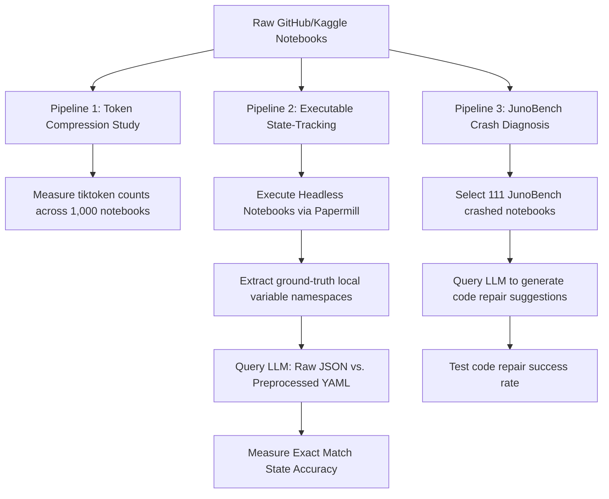

# Large-Scale Preprocessor Evaluation Plan

This document outlines the architecture and execution pipeline for running a large-scale evaluation of the Jupyter Preprocessor. This protocol isolates token reduction, state-tracking accuracy, and debugging effectiveness on hundreds of real-world notebooks.

---

## 📐 Evaluation Architecture

To scientifically prove our hypothesis at scale, we use a two-pronged approach:



---

## 🛠️ Phase 1: Token Compression Study (1,000 Notebooks)

*   **Goal:** Measure token savings across a diverse corpus of Jupyter notebooks from different domains.
*   **Data Source:** Sample 1,000 raw `.ipynb` files from the **MSR '22 Zenodo Corpus** (847k notebooks) or directly from GitHub using code search.
*   **Execution:**
    1.  Load each notebook's raw JSON string.
    2.  Tokenize raw JSON using `tiktoken` (`cl100k_base` encoding).
    3.  Preprocess the notebook using our `RuleBasedPreprocessor` (stripping base64 plots, HTML, metadata, and converting JSON to YAML).
    4.  Tokenize the preprocessed YAML string.
    5.  Compute average and distribution of token savings.

---

## ⚙️ Phase 2: Automated Dynamic State-Tracking (100 Notebooks)

To test accuracy without relying on manual question drafting, we can **dynamically execute** notebooks to collect exact runtime ground truths.

### 1. Headless Execution Setup
Use **`papermill`** or **`nbconvert`** to execute each notebook headlessly.
```python
import nbformat
from nbconvert.preprocessors import ExecutePreprocessor

with open("notebook.ipynb") as f:
    nb = nbformat.read(f, as_version=4)

ep = ExecutePreprocessor(timeout=600, kernel_name='python3')
# Execute notebook to populate all actual outputs
ep.preprocess(nb, {'metadata': {'path': './'}})
```

### 2. State Interception
Inject a namespace-logging script at the end of each cell during headless execution. The script serializes the type, value, and shape of active local variables:
```python
# Injected script
import pickle
import sys
local_vars = {k: v for k, v in locals().items() if not k.startswith('_')}
with open("state_snapshot.pkl", "wb") as f:
    pickle.dump(local_vars, f)
```
This builds an **incontestible ground truth** of variables at every step of execution.

### 3. Automated Question Formulation
For each variable $V$ at cell step $C$:
*   *Question:* "What is the type and shape of variable `V` immediately after execution step C?"
*   *Expected Answer:* Ground truth (e.g. `type: DataFrame, shape: (1000, 15)`).

### 4. Raw vs. Preprocessed LLM Queries
*   **Group A (Raw):** Feed the LLM the raw visual cell codes and outputs up to step $C$.
*   **Group B (Preprocessed):** Feed the LLM the sorted YAML cells and our `variables` table up to step $C$.
*   **Metric:** Compare Exact Match (EM) accuracy of predicted variable types and shapes.

---

## 🐞 Phase 3: JunoBench Crash Diagnosis (111 Notebooks)

*   **Goal:** Prove that the preprocessor helps LLMs solve real developer debugging tasks.
*   **Data Source:** Hugging Face dataset `PELAB-LiU/JunoBench`.
*   **Execution:**
    1.  For each of the 111 notebooks, retrieve the notebook state prior to the crash.
    2.  **Raw Prompt:** Provide the LLM the raw, visual notebook JSON + error traceback. Ask it to output the correct code modification to fix the crash.
    3.  **Preprocessed Prompt:** Provide the preprocessed YAML + active variable namespace table + cleaned traceback. Ask it to output the correct code modification.
    4.  **Verification:** Statically evaluate or execute the proposed fix in a Docker environment to verify if the crash is resolved.
    5.  **Metric:** Compare Bug Fix Success Rate (%) and the Token Cost ($) to achieve it.

---

## 📈 Metric Analysis: OckScore

To compare token efficiency and accuracy together, we use the **OckScore** (based on Occam's Razor / OckBench):

$$\text{OckScore} = \frac{\text{Accuracy (\%)}}{\text{Avg. Tokens Used} / 1000}$$

A higher OckScore indicates that the prompt representation transfers information more efficiently (higher accuracy with fewer tokens).
